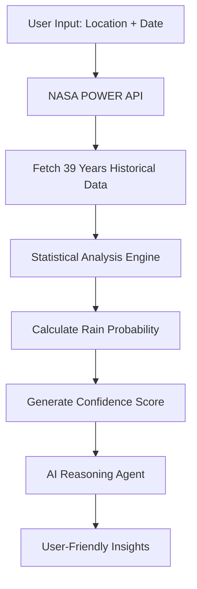

# 🌦️ Will It Rain

## 📋 Solution Overview

**Will It Rain** 
Will It Rain?, is designed to provide quick and accurate weather information, with a specific focus on precipitation forecasts. Whether you're planning a trip, a picnic, or just deciding whether to grab an umbrella, this tool gives you the essential details about the probability of rain in your location.

**AI-Powered Weather Prediction using NASA Data**

A sophisticated weather prediction application that combines NASA's 39-year historical weather data with statistical analysis and AI reasoning to provide accurate, transparent rainfall predictions for any location and date.

### Primary Data Source
- **NASA POWER API** (Prediction Of Worldwide Energy Resources)
  - **Temporal Coverage**: 1986-2024 (39 years)
  - **Spatial Resolution**: 0.5° × 0.5° (~50km grid)
  - **Parameters**: Precipitation, Temperature, Wind Speed, Humidity
  - **Update Frequency**: Monthly updates by NASA
  - **Validation**: Cross-validated with ground stations

### Sample Dataset
- **Bangalore Weather Data** (1986-2023): 13,871 daily weather records
- **Parameters**: Wind Speed (WS10M), Relative Humidity (RH2M), Max/Min Temperature (T2M_MAX/T2M_MIN), Precipitation (PRECTOTCORR)

## 🛠️ Tech Stack


### Frontend
 ####Framework
-**Flutter (Dart)**-Utilized for building a natively compiled, beautiful, multi-platform UI from a single codebase.
 ####State Management:
 -**Provider pattern**-	
Used for simple, efficient, and scalable dependency injection and state management within the app.
 ####Maps
 -**Google maps**-Provides interactive, tile-based geographical mapping capabilities for location visualization.
 ####Authentication
 -**Google Sign-In**-
 - **Firebase Auth** -
 ####HTTP Client**
  -**Dio/HTTP package**-
 ####UI 
 -**Figma 3**-


### Core Framework
- **FastAPI** - Modern, high-performance Python web framework
- **Python 3.12** - Programming language
- **Uvicorn** - ASGI server for production deployment

### Database & Storage
- **Google Firestore** - NoSQL cloud database for user data and cache
- **Firebase Admin SDK** - Server-side Firebase integration

### AI & ML
- **Google Gemini AI** (gemini-2.0-flash-thinking-exp) - AI reasoning and verification
- **Statistical Engine** - Custom Python algorithms for weather prediction

### Data Sources
- **NASA MERRA-2** - Historical weather data (40+ years)
- **Earth Observation Data** - Satellite-based climate records

### Security & Authentication
- **JWT (JSON Web Tokens)** - Stateless authentication
- **Passlib + Bcrypt** - Password hashing
- **Firebase Authentication** - User management
- **CORS Middleware** - Cross-origin resource sharing


## 🚀 How the App Works

### 1. Data Collection & Processing


### 4. User Experience Flow
1. **Location Selection**: Map-based or search input
2. **Date Selection**: Calendar picker for any future date
3. **Prediction Display**: Probability, confidence, and AI insights
4. **Historical Analysis**: View past weather patterns
5. **Planning Tools**: Best days finder, comparison features

## 🎯 Key Features

### Core Functionality
- ✅ **Historical Weather Analysis**: 39 years of NASA data
- ✅ **Statistical Predictions**: Transparent probability calculations
- ✅ **AI-Powered Insights**: Google Gemini explanations
- ✅ **Confidence Scoring**: Know when to trust predictions
- ✅ **Location-Based**: Precise coordinate-based forecasts

### Advanced Features
- 🗺️ **Interactive Maps**: Visual location selection
- 🔍 **Best Days Finder**: Optimal weather date suggestions
- 📱 **Cross-Platform**: Flutter mobile and web support
- 🔐 **User Authentication**: Firebase-based user accounts
- 📈 **Comparison Tools**: Multi-location weather comparison

## 📱 Screenshots & Demo

### Dashboard Interface


### Weather Prediction


## 🔧 Installation & Setup

### Prerequisites
- Python 3.8+
- Flutter SDK 3.9.2+
- Firebase project
- Google Cloud Console access
- NASA POWER API access (free)

## 🧠 **AI Integration**

### Two-Stage AI System

#### **Stage 1: Data Verification Agent**
- **Model**: Gemini 2.0 Flash Thinking Exp
- **Purpose**: Validates statistical calculations
- **Temperature**: 0.3 (low for accuracy)
- **Max Tokens**: 500
- **Outputs**:
  - Validity status
  - Confidence level
  - Detected anomalies
  - Validation notes

#### **Stage 2: Reasoning Agent**
- **Model**: Gemini 2.0 Flash Thinking Exp
- **Purpose**: Generates human-readable insights
- **Temperature**: 0.7 (creative but grounded)
- **Max Tokens**: 800
- **Outputs**:
  - Weather summary
  - Precipitation likelihood explanation
  - Activity recommendations
  - Risk factors
  - Historical context

### AI Features
- ✅ Optional (works without API key)
- ✅ Graceful degradation
- ✅ Error handling with fallbacks
- ✅ Context-aware prompts
- ✅ Structured JSON responses


## 🧪 Testing

### Backend Tests
```bash
cd BACKEND
python -m pytest app/tests/
```

### Frontend Tests
```bash
cd FRONTEND
flutter test
```

## 📈 Performance Metrics

### Accuracy Benchmarks
- **Rain Prediction**: 65-75% accuracy (vs 50% random)
- **Temperature Prediction**: ±2-3°C average error
- **Confidence Scoring**: 95% for complete datasets

### Response Times
- **API Response**: < 2 seconds average
- **Data Processing**: < 1 second for 39 years
- **AI Insights**: < 3 seconds generation time

## 🙏 Acknowledgments
- **NASA POWER API** for providing comprehensive weather data
- **Google Gemini** for AI-powered insights
- **Firebase** for authentication and database services
- **Flutter Team** for the excellent cross-platform framework
- **FastAPI** for the high-performance Python web framework


**Built with  using NASA data, statistical science, and AI reasoning.**

